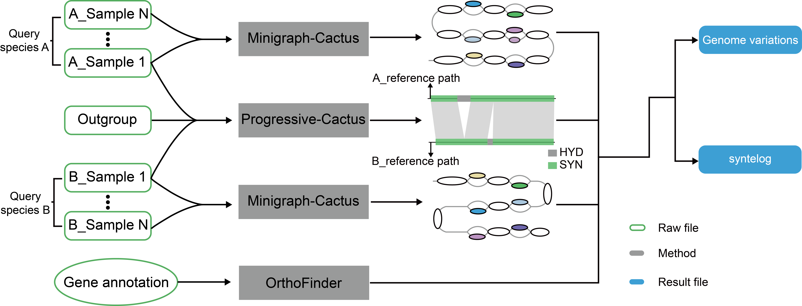

<h1 align="center">Graph genome comparison workflow</h1>
<div align="center">
    <a href="https://github.com/HZAU-CottonLab/GGCW/stargazers">
        
    </a>
    <a href="https://memotrace.cn/" target="_blank">
        
    </a>
    <a href="https://memotrace.cn/" target="_blank">
        
    </a>
    <a href="https://memotrace.cn/" target="_blank">
        
    </a>
    <a href="https://github.com/HZAU-CottonLab/GGCW/releases" target="_blank">
        
    </a>
</div>

<blockquote>
    <div style="background-color: #eaf7ea; border-radius: 10px; padding: 20px; position: relative;">
    <div style="position: relative;">
        <div style="position: absolute;top: 0;bottom: 0;left: 0;width: 2px;background-color: #000000;"></div>
        <h2>GGCW</h2>
        <div style="text-indent: 2em;">
            <p>
                This workflow is designed for comparing different species at the pan-genomic level and provides base-level alignment information to identify sequence with <strong>synteny (SYN) </strong>as well as <strong>hyper divergence (HYD)</strong>. Moreover, according to the orthogroups inferred by OrthoFinder, homologous genes located in collinear regions can be identified.
            </p>
        </div>
    </div>
    </div>
</blockquote>

## Work flow
<div align="center">
    
</div>

> The workflow is developed based on Snakemake, which comprises several interdependent parts. For instance, when comparing genomes, it is necessary to manually modify the corresponding configuration files.
```bash
#? example data direction test/
- raw_genome.config  #? for genome masked
- mashTree.config  #? for phylogenetic tree
- evolution.txt #? for Progressive-Cactus
- species_A.txt #? for Minigraph-Cactus
- species_B.txt #? Minigraph-Cactus
```

### Table of contents

- Genome alignment
    - softmasked genome
    - phylogenetic tree
    - Progressive-Cactus (aligning reference samples for different species)
    - Minigraph-Cactus (aligning same species)
    - identity SYN and HYD
-   homologous gene in SYN
    - OrthoFinder
    - identified homoeologous in SYN region

## Requirements

- Python (v3.10.12)
    - pandas (v2.2.0)
    - pysam (v0.22.0)
    - pybedtools (v0.9.1)
- Perl (v5.34.0)
- Snakemake (7.25.0)
- Cactus (6.0.0)
- mashtree (v1.4.6)
- quicktree (v2.5)
- seqtk (v1.4-r122)


## Install

### Used in container 
```bash
#* pull the container
singularity pull GGCW.sif library://zpliu/bioinfomatic/ggcw:v1.0

#* pull the Snakemake pipline
wget -c https://github.com/HZAU-CottonLab/GGCW/archive/refs/tags/v1.0.tar.gz
```


## Usage example

> test Data download </br>
> `wget https://zenodo.org/api/records/10697234/files-archive`
> + `example_data.tar.gz`  example test data 
> + `example_result.tar.gz` result for example data 

```bash
#* pull container
singularity pull GGCW.sif library://zpliu/bioinfomatic/ggcw:v1.0
#TODO run snakemake
#* show pipline
singularity exec GGCW.sif snakemake --cores 1 -np 
```


